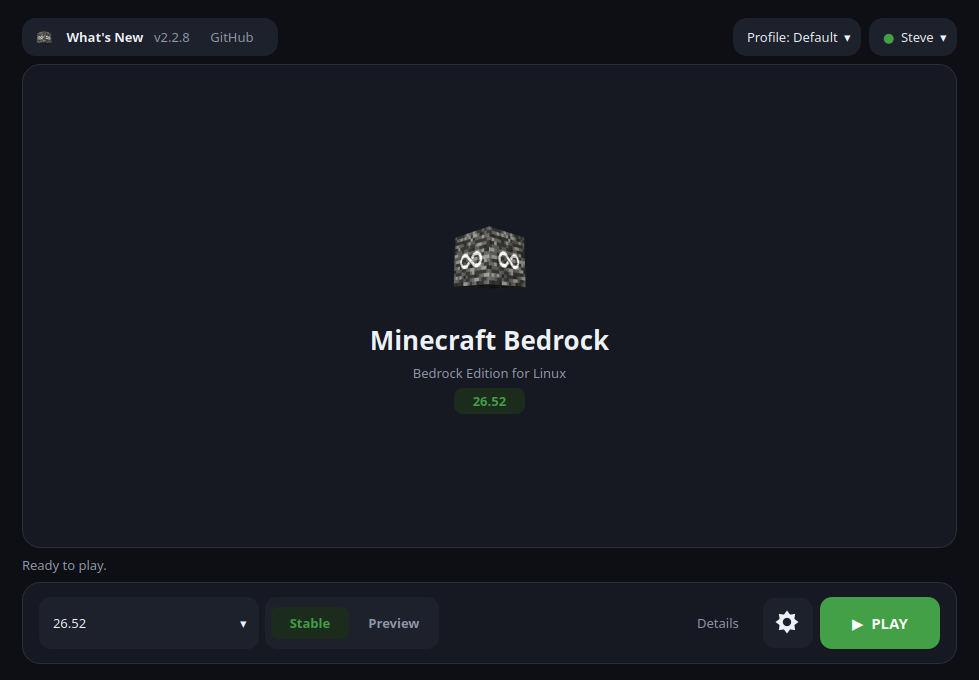

<div align="center">

# 🟩 BedrockOnLinux

**Minecraft Bedrock for Windows, running on Linux, with real Xbox sign-in,
Friends, servers and Realms.**

[](https://github.com/Wyze3306/BedrockOnLinux/releases/latest)
[](https://github.com/Wyze3306/BedrockOnLinux/releases)
[](https://wyze3306.github.io/BedrockOnLinux/)
[](https://discord.gg/5YJq54Yhbu)
[](LICENSE)




</div>

## What it is

BedrockOnLinux installs and runs the Windows version of Minecraft Bedrock on
Linux. It downloads the game from the Microsoft Store with your own account,
sets everything up for you, and starts it. No Windows, no second machine,
nothing to compile.

You sign in to Microsoft from inside Minecraft, exactly as on Windows, so
Friends, invitations, public servers, Realms and the Marketplace work like they
should. Nothing goes through a third party.

You can also play without signing in to Xbox Live: single-player worlds and LAN
games work, only the online features are out of reach. Starting the game does
need an internet connection, though: a game downloaded from the Microsoft Store
stays encrypted on disk, and Microsoft hands out the key to it each time it
starts. Achievements show up in the
game, but they don't unlock yet.

## Install

Download the file you want from the
[latest release](https://github.com/Wyze3306/BedrockOnLinux/releases/latest).

| Format | Best for | How to start it |
|---|---|---|
| AppImage | Most Linux desktops | `./BedrockOnLinux-*-x86_64.AppImage` |
| `.deb` | Debian, Ubuntu, Mint, LMDE | `sudo apt install ./bedrock-on-linux_*_amd64.deb` |
| `.rpm` | Fedora, Nobara | `sudo dnf install ./bedrock-on-linux-*.x86_64.rpm` |
| Flatpak | Atomic systems such as Bazzite | `flatpak install --user ./BedrockOnLinux-*-x86_64.flatpak` |
| Nix | NixOS, or any Linux with Nix installed | `nix run github:Wyze3306/BedrockOnLinux` |

The launcher tells you when a new version is out. The AppImage updates itself.
The `.deb` and `.rpm` update themselves too, through apt or dnf: **Update now**
downloads the new package, checks it against the release's checksums, and
asks for your password to install it. For the Flatpak, download the new file
and install it with the same command.
Keep `--user` for the Flatpak: without it, Flatpak installs a second,
system-wide copy, and the menu keeps starting the per-user one at the old
version. `flatpak uninstall --system io.github.wyze3306.BedrockOnLinux` removes
that extra copy.

### Nix / NixOS

Try it without installing anything:

```bash
nix run github:Wyze3306/BedrockOnLinux
```

Or add it as a flake input to install it declaratively, for example into
`environment.systemPackages`:

```nix
# flake.nix
{
  inputs = {
    nixpkgs.url = "github:NixOS/nixpkgs/nixos-unstable";
    bedrock-on-linux = {
      url = "github:Wyze3306/BedrockOnLinux";
      inputs.nixpkgs.follows = "nixpkgs";
    };
  };

  outputs = { self, nixpkgs, bedrock-on-linux, ... }: {
    nixosConfigurations.your-host = nixpkgs.lib.nixosSystem {
      system = "x86_64-linux";
      modules = [
        {
          environment.systemPackages = [
            bedrock-on-linux.packages.x86_64-linux.default
          ];
        }
        # ...your other modules
      ];
    };
  };
}
```

## Play

1. Open **BedrockOnLinux** and sign in with the Microsoft account that owns
   Minecraft. It is asked for twice, once to download the game from the
   Microsoft Store, once to play online, because the Store needs a session
   of its own. Use the same account both times; the launcher offers the
   second sign-in right after the first, and again if a download needs it.
   The first Store sign-in may also bring up a password prompt from your
   desktop: it registers this PC as a Microsoft Store device, as Windows
   does, and reads the firmware's system information for it (manufacturer,
   model, serial number and UUID), which only root can read. Cancelling that
   prompt is fine; the PC is registered without it, as in the Flatpak.
2. Pick **Minecraft** or **Minecraft Preview**, choose a version, and hit
   **PLAY**.
3. Play, including the **Friends**, **Servers** and **Realms** tabs.

The first launch downloads the game and everything it needs, so give it a
while; after that it starts straight away. You can install an older version
too, which is handy when a server hasn't updated yet.

The launcher can be used with a controller — the d-pad or left stick moves the
highlight, **A** selects, **B** goes back, the shoulder buttons change tab and
**Start** plays — and **Tools ▸ Create direct launch shortcut** adds a
*Minecraft Bedrock* entry to your app menu or to Steam. That is the one to use
on a Steam Deck.

On a laptop with two graphics cards, **Settings ▸ Advanced ▸ Graphics card**
chooses the one Minecraft plays on.

Mojang's **Bedrock Editor** is part of the game: open it from **Settings ▸
Tools ▸ Open Bedrock Editor**, the *Open Bedrock Editor* action of the app menu
entry, or `bedrock-on-linux play --editor`.

### BetterRTX

[BetterRTX](https://bedrock.graphics) presets install from **Settings ▸ Tools ▸
BetterRTX**, or from a terminal:

```bash
bedrock-on-linux betterrtx list
bedrock-on-linux betterrtx install default
bedrock-on-linux betterrtx restore
```

A preset only works with the Minecraft version it was built for, so the
launcher installs one only when its shaders match the selected version, and
keeps the game's own shaders so **restore** can put them back. `install` also
takes a `.rtpack` file.

### Experimental OptiScaler / frame generation

The launcher can install a tested OptiScaler v10 setup for Minecraft RTX under
Wine/vkd3d-proton, including the physical `nvngx.dll` workaround needed to
expose Bedrock's native DLSS input on the tested non-NVIDIA setup:

```bash
bedrock-on-linux optiscaler install
bedrock-on-linux optiscaler status
```

OptiScaler is downloaded from upstream and is not bundled with this project.
Frame generation remains opt-in in the OptiScaler overlay. See
[docs/OPTISCALER.md](docs/OPTISCALER.md) for the exact setup, management
commands, tested pipeline and compatibility notes.

## What you need

- A 64-bit Linux desktop, reasonably up to date.
- A graphics card and driver that support Vulkan: anything from the last few
  years, with the driver your distribution ships.
- A Microsoft account that owns Minecraft, since the game is downloaded under
  your own licence.
- Enough free disk space for the game and its runtime, a few gigabytes.

## macOS

There is a `macos` branch of this launcher, and it is honest about what it can
do. The launcher itself runs natively on a Mac: the same window, the same
settings, the same `doctor`, with its data in
`~/Library/Application Support/bedrock-on-linux`. What changes is underneath.

The Windows runtime is a **native macOS Wine**, not GDK-Proton — the launcher
finds Apple's [Game Porting Toolkit][gptk], CrossOver, Whisky or a plain Wine,
in that order, and uses the best one you have. It installs none of them: they
are separate products with their own licences. Point it at a specific build
with `BOL_WINE=/path/to/wine` if you want a different one.

With CrossOver, the launcher's Wine prefix becomes a CrossOver bottle of its
own, kept where the launcher keeps its prefix
(`~/Library/Application Support/bedrock-on-linux/compatdata/pfx`). It does
not use or need your `default` bottle, and it does not show up among
CrossOver's bottles.

[gptk]: https://developer.apple.com/games/game-porting-toolkit/

Two things do **not** work on macOS, and neither is fixable from this
repository alone:

- **Downloading Minecraft.** The Microsoft Store download and the decryption
  the game needs at every launch both live in `xodus-cli`, which is built for
  Linux and links WebKitGTK. So on a Mac you bring your own **decrypted**
  Minecraft for Windows folder: **Settings ▸ Versions ▸ Use a Minecraft
  folder…**, or PLAY, which offers the same choice when there is no game yet.
  Choose the folder that holds `Minecraft.Windows.exe` and `appxmanifest.xml`,
  or any folder above it. The launcher copies it into its own `games` folder
  and leaves the original untouched; on APFS the copy is a clone, which takes
  no extra space. From a terminal:
  `bedrock-on-linux setup --game-dir "/path/to/Minecraft for Windows"`.
  A folder whose `Minecraft.Windows.exe` is still encrypted, as the Microsoft
  Store and the Xbox app keep it on disk, is refused by name.
- **Signing in to Xbox Live.** The in-game sign-in is the WineGDK XUser fork
  compiled into GDK-Proton, and there is no macOS build of it. The game runs
  **offline and on the LAN**: single-player worlds and LAN play, no Realms, no
  servers, no Marketplace, no Friends.

Minecraft for Windows is a GDK game: it quits as soon as it starts without
a Gaming Runtime (`xgameruntime.dll`), and no macOS Wine ships one. The
launcher installs WineGDK's into its prefix, the same file its Linux engine
uses, checked against the engine's own SHA-256. The `.app` carries it; run
from a checkout instead, the launcher reads it once out of the engine release
archive (about 570 MB of download).

What that leaves working is a real thing — a Mac running Bedrock's own Windows
build, on a prefix the launcher prepares, with the GameInput controller stack,
the CA bundle, the stack-reserve fix and the UI patches all applied exactly as
on Linux, because every one of those operates on Windows files.

Build the application bundle with:

```bash
scripts/build-macos-app.sh
```

It runs on a Mac and, just as well, on Linux: nothing in the bundle is
compiled, and pip resolves the macOS universal2 wheels by tag, so a Linux box
produces the same `BedrockOnLinux.app` — unsigned, and with the icon written by
`scripts/png2icns.py` in place of `iconutil`. Cross-building needs `zip` and
Pillow; the script checks that every bundled binary really is Mach-O before it
packages anything.

Run `bedrock-on-linux doctor` there first: it names the Windows runtime it
found, and says which of the checks above simply do not apply.

## If something goes wrong

Start with the built-in check, which looks at your system and tells you what is
wrong:

```bash
bedrock-on-linux doctor
```

If the game itself misbehaves after an update or a crash, `bedrock-on-linux
repair` rebuilds the Windows environment without touching your worlds. Logs are
one click away in **Settings**, and the same commands are available from the
AppImage or Flatpak through their own entry point.

Still stuck? Ask on [Discord](https://discord.gg/5YJq54Yhbu) or
[open an issue](https://github.com/Wyze3306/BedrockOnLinux/issues) with your
launcher version, your distribution, your GPU and the log, but never your
account details.

## Uninstalling

Removing the app leaves what it downloaded where it was: the game, the Wine
prefix with your worlds in it, the game engine and its runtime, several
gigabytes in all. A package manager does not know about those files, and an
AppImage has no uninstaller at all. To remove everything:

1. If you want to keep your worlds, copy
   `~/.local/share/bedrock-on-linux/compatdata/pfx/drive_c/users/steamuser/AppData/Roaming/Minecraft Bedrock`
   somewhere first.
2. Delete `~/.local/share/bedrock-on-linux`, or the folder you moved the
   installation to in **Settings** (`~/.config/bedrock-on-linux` records it;
   delete that too).
3. Delete the shortcuts the launcher made, if any:
   `~/.local/share/applications/bedrock-on-linux-*.desktop`, and the
   *Minecraft Bedrock* entry you added to Steam. Launchers before 2.2.2 also
   left `~/.xodus-keyring.ron` in your home folder.

For the Flatpak, `flatpak uninstall --delete-data io.github.wyze3306.BedrockOnLinux`
does all of it.

## Building

Everything is built from source by a public, reproducible pipeline, and each
release is signed. The details are in [`docs/BUILD.md`](docs/BUILD.md).

## Legal

BedrockOnLinux ships **no Minecraft game files**. The game is downloaded from
Microsoft's own servers, under your own account's licence, by
[Xodus](https://github.com/xodus-gaming/xodus), so you have to own Minecraft,
and the terms that come with it still apply.

BedrockOnLinux is MIT licensed, see [`LICENSE`](LICENSE); the components it
bundles keep their own licences. This is an independent project, not affiliated
with or supported by Mojang or Microsoft.
